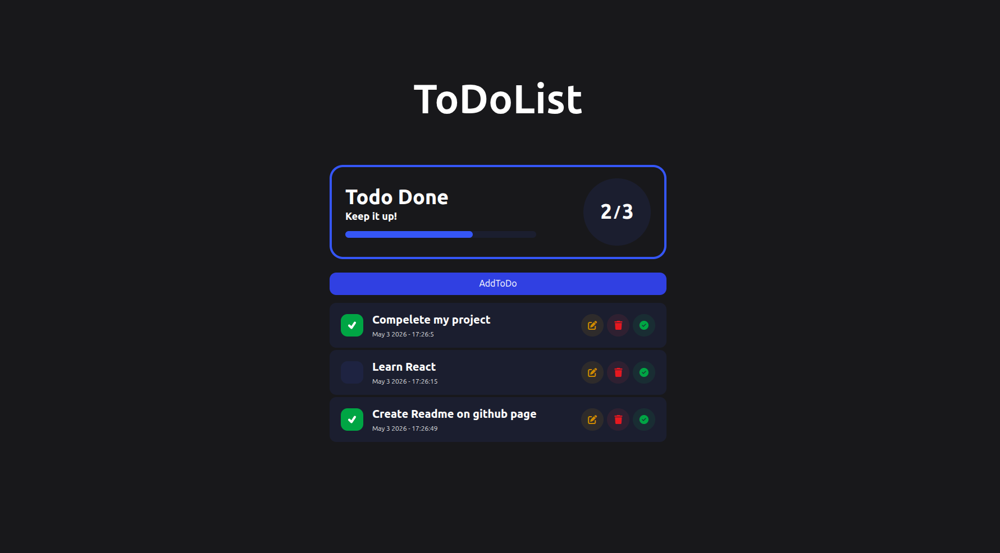

# Dual-List Todo App

A modern and interactive **To-Do List** application built with **HTML, Tailwind CSS, and JavaScript**.
It allows users to manage tasks efficiently with instant feedback through **Toast notifications** and a clear **progress indicator**. Tasks are persisted using **Local Storage**, ensuring continuity across sessions and page refreshes.

---

##  Features

*   **Responsive UI** powered by **Tailwind CSS** for seamless viewing on any device.
*   **Intuitive Task Management:** Easily add and delete tasks.
*   **Visual Progress Tracking:** A dynamic progress indicator reflects the completion status of tasks.
*   **User Feedback:** Instant **Toast notifications** confirm user actions like adding, removing, or moving tasks.
*   **Persistent Storage:** All tasks and their states are saved using **Local Storage**, so your to-do list is always up-to-date, even after refreshing the page or closing the browser.

---

## 🖼️ Preview

Below is a preview of the Dual-List Todo App in action.

*The image displays the application's interface, showcasing the dual-list layout and task management.*

---

## 🛠 Tech Stack

    
    
    
       

---

##  Notes

*   The application utilizes Toast messages for immediate user feedback on various actions.
*   Task progress is calculated dynamically based on the current state of tasks (e.g., completed vs. total tasks).
*   Data is stored locally in the browser's Local Storage.

---

##  Enjoy!

This app is designed to help you stay organized and manage your tasks efficiently with a clean, interactive, and persistent interface.
