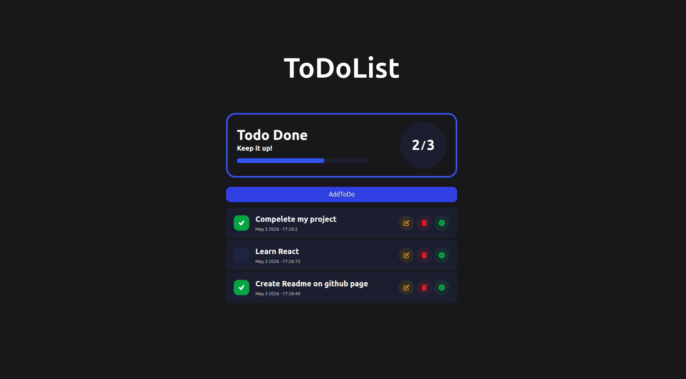

# Dual-List Todo App

A modern and responsive **To-Do List Application** built with **HTML, Tailwind CSS, and JavaScript**.

This application helps users manage their daily tasks through a clean and intuitive interface. It provides real-time feedback with Toast notifications, visual progress tracking, and persistent data storage using Local Storage.

---

## ✨ Features

- ✅ Add new tasks instantly
- 🗑️ Delete tasks with ease
- 📊 Dynamic progress tracking
- 🔔 Real-time Toast notifications
- 💾 Persistent data storage using Local Storage
- 📱 Fully responsive design
- ⚡ Fast and lightweight performance
- 🎨 Modern UI powered by Tailwind CSS

---

## 🖼️ Preview

---

## 🚀 Live Demo

https://to-do-list-virid-chi-99.vercel.app/

---

## Technologies Used

---

## 💡 How It Works

1. Enter a task and add it to the list.
2. Manage tasks through the interface.
3. Track your progress with the progress indicator.
4. Receive instant feedback through Toast notifications.
5. All data is automatically saved in Local Storage.

---

## 📌 Key Concepts Used

- DOM Manipulation
- Event Handling
- Local Storage API
- Array Methods
- Responsive Design
